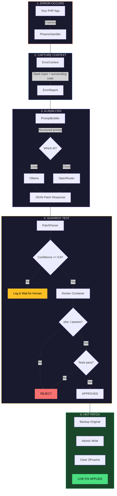
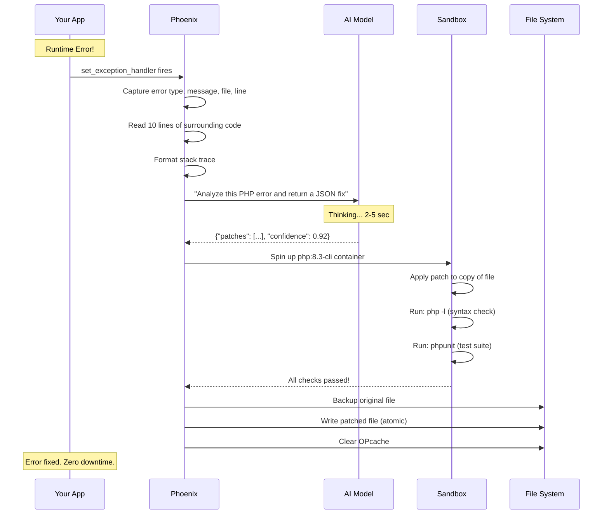
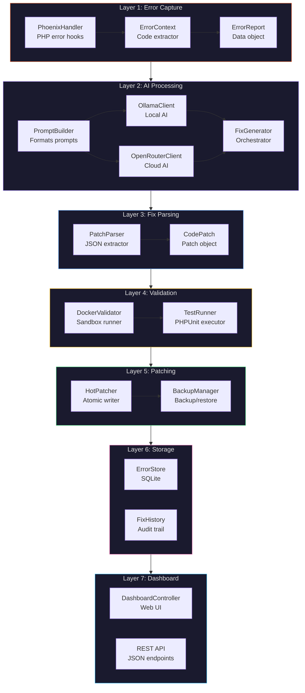
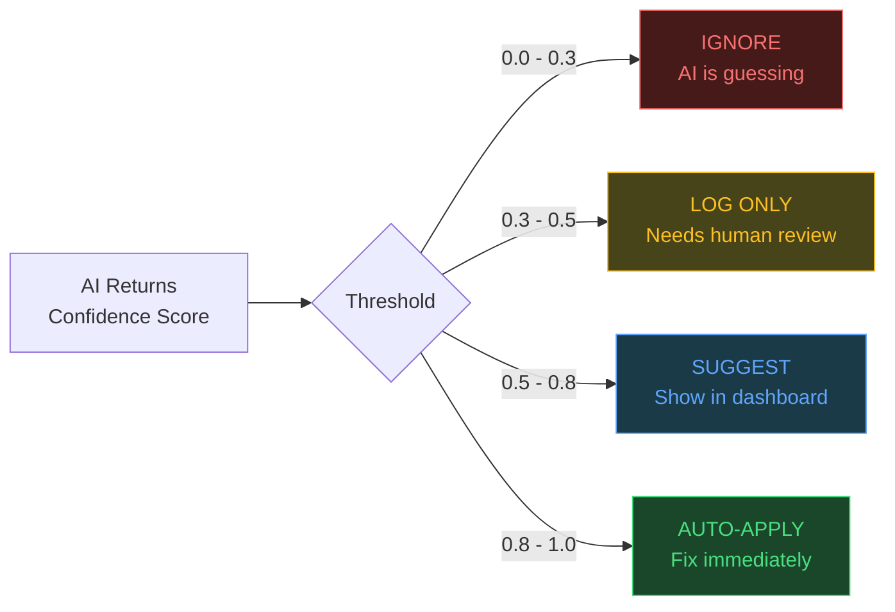
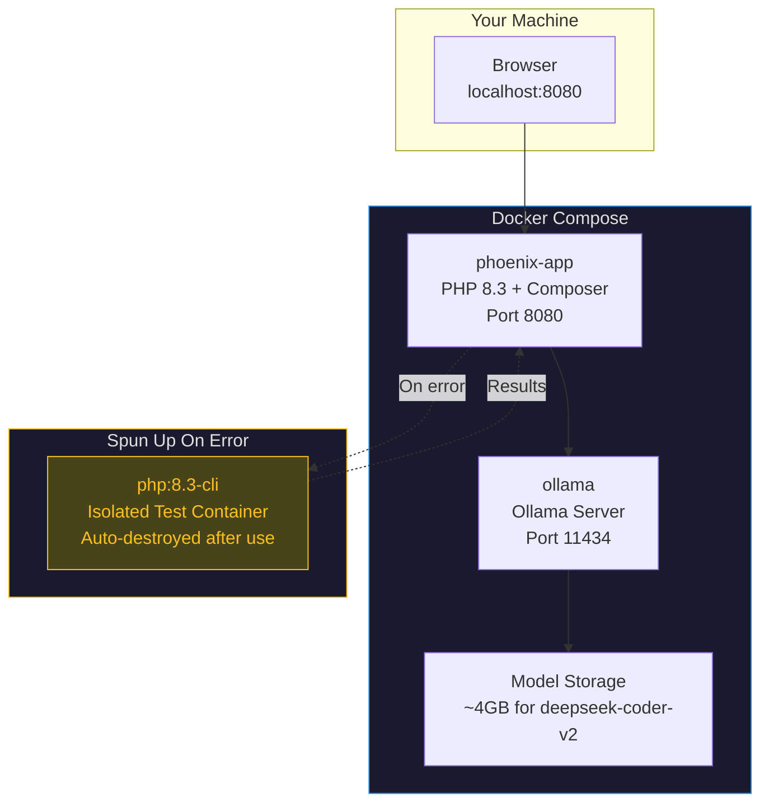
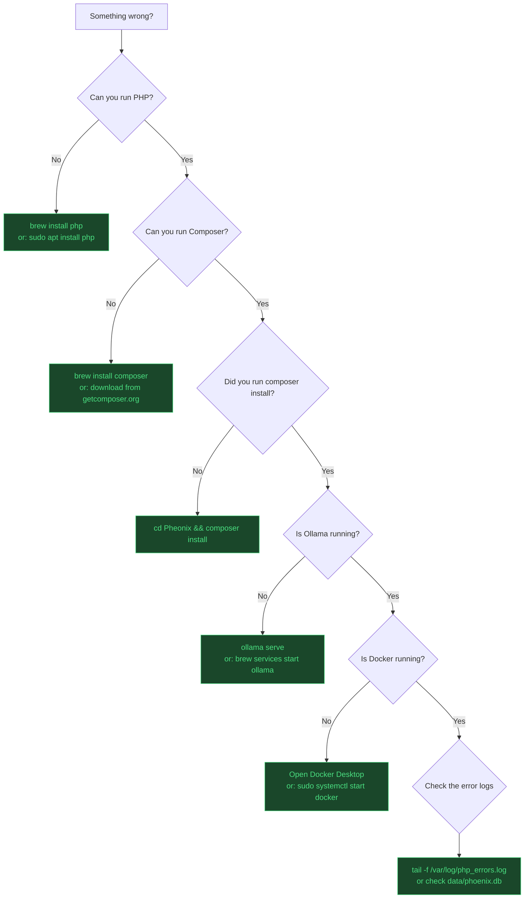
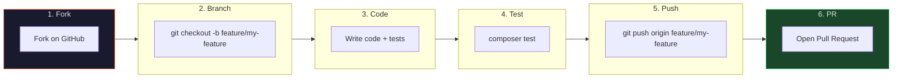

<div align="center">


<br>


---

# PHOENIX

### Your Code Crashes. Phoenix Fixes It. Automatically.

**The world's first self-healing PHP framework that uses AI to catch, diagnose, test, and fix runtime errors in production — without human intervention.**

<br>

```
  ____  _   _  _____ _____ _   _ ____   ___  __  __ _____
 |  _ \| | | |_   _| ____| \ | / ___| / _ \|  \/  | ____|
 | |_) | |_| | | | |  _| |  \| \___ \| | | | |\/| |  _|
 |  __/|  _  | | | | |___| |\  |___) | |_| | |  | | |___
 |_|   |_| |_| |_| |_____|_| \_|____/ \___/|_|  |_|_____|
```

<br>

**Stop waking up at 3 AM to fix production bugs.**
**Phoenix catches errors, asks AI for a fix, tests it in Docker, and patches your live code.**
**All in under 30 seconds.**

<br>

---

**Quick Links:** [Why Phoenix?](#why-phoenix) | [Live Demo](#-try-it-yourself---60-second-demo) | [How It Works](#how-it-works---the-full-story) | [Quick Start](#quick-start) | [API Docs](#api-reference) | [Contributing](#contributing)

</div>

---

## The Problem Every Developer Faces

It's 3 AM. Your phone buzzes. Production is down.

```
[ERROR] TypeError: Cannot access property "name" on null
  at /var/www/app/src/UserService.php:15
  at /var/www/app/src/ApiController.php:42
  at /var/www/app/public/index.php:7

HTTP 500 — Internal Server Error
1,247 users affected
Revenue lost: $$$$ per minute
```

**What happens next (without Phoenix):**

```
1. Wake up                                    (5 min)
2. Open laptop, connect to VPN                (3 min)
3. SSH into production server                 (2 min)
4. Find the right log file                    (5 min)
5. Read stack trace, understand the bug       (15 min)
6. Write a fix                                (10 min)
7. Test locally                               (5 min)
8. Deploy to staging                          (5 min)
9. Run tests on staging                       (10 min)
10. Deploy to production                      (5 min)
11. Verify it works                           (5 min)
                                           --------
Total: ~70 minutes of downtime
```

**What happens next (with Phoenix):**

```
1. Phoenix catches the error                  (0.1 sec)
2. AI generates a fix                         (3 sec)
3. Docker tests the fix                       (5 sec)
4. Fix applied to production                  (0.1 sec)
                                           --------
Total: ~8 seconds. Zero human intervention.
```

---

## Why Phoenix?

<table>
<tr>
<td width="50%">

### Without Phoenix

- 3 AM pages ruin your sleep
- 70+ min average time to fix
- Manual log diving is painful
- Fixes are rushed, sometimes wrong
- Production stays down while you debug
- Every developer solves the same bugs

</td>
<td width="50%">

### With Phoenix

- Errors fix themselves automatically
- 8 seconds average time to fix
- AI analyzes stack trace + code context
- Every fix is tested in an isolated sandbox
- Zero-downtime hot-patching
- Learn from every fix forever

</td>
</tr>
</table>

---

## How It Works — The Full Story

### The Pipeline (Visual)



### The Sequence (Step by Step)



---

## Try It Yourself — 60-Second Demo

### Step 1: Install Phoenix

```bash
git clone https://github.com/soumyachk101/Pheonix.git
cd Pheonix
composer install
cp .env.example .env
```

### Step 2: Create a Buggy PHP File

Create `test_buggy.php` in the project root:

```php
<?php
require_once __DIR__ . '/vendor/autoload.php';

// Initialize Phoenix — one line, that's it
Phoenix\init();

// --- YOUR APP CODE BELOW ---

class UserService {
    public function getUserName(?string $userId): string {
        $user = $this->findUser($userId);
        return $user->name;  // BUG: $user can be null!
    }

    private function findUser(?string $id): ?object {
        // Simulates a database lookup that returns null
        return null;
    }
}

$service = new UserService();
echo $service->getUserName("user-123");
```

### Step 3: Run It

```bash
php test_buggy.php
```

### Step 4: Watch Phoenix Work

```
[Phoenix] Error caught: TypeError
[Phoenix] Message: Cannot access property "name" on null
[Phoenix] File: /app/test_buggy.php, Line: 8
[Phoenix] Context captured: 10 lines around error
[Phoenix] Sending to AI (Ollama: deepseek-coder-v2)...
[Phoenix] AI Response received (confidence: 0.92)
[Phoenix] Root cause: Accessing property on potentially null object
[Phoenix] Testing patch in Docker container...
[Phoenix] Syntax check: PASSED
[Phoenix] Backing up original file...
[Phoenix] Applying patch...
[Phoenix] OPcache cleared
[Phoenix] FIX APPLIED SUCCESSFULLY
```

### Step 5: See the Fix

```php
// Before (buggy):
return $user->name;

// After (Phoenix fixed it):
return $user?->name ?? 'Unknown';
```

**The file on disk has been modified. Your app is fixed.**

---

## Architecture Deep Dive

### Component Map



### How Each Layer Works

<details>
<summary><b>Layer 1: Error Capture</b> — How Phoenix catches every error</summary>

<br>

Phoenix hooks into PHP's three error-handling mechanisms:

```php
// PhoenixHandler.php — register()
set_error_handler([$this, 'handleError']);        // Catches warnings, notices
set_exception_handler([$this, 'handleException']); // Catches uncaught exceptions
register_shutdown_function([$this, 'handleShutdown']); // Catches fatal errors
```

When an error fires, `ErrorContext` captures:

```php
// What gets captured for every error:
[
    'type'        => 'TypeError',                    // Error type
    'message'     => 'Cannot access property...',    // Error message
    'file'        => '/app/src/UserService.php',     // Full file path
    'line'        => 15,                             // Exact line number
    'stack_trace' => '#0 /app/src/Api.php(42)...',   // Full trace
    'code_context' => [                              // 10 lines around error
        10 => 'class UserService {',
        11 => '    public function getUserName(?string $userId): string {',
        12 => '        $user = $this->findUser($userId);',
        13 => '        // TODO: add null check',
        14 => '',
        15 => '        return $user->name;',    // <-- THE ERROR LINE
        16 => '    }',
        17 => '',
        18 => '    private function findUser(?string $id): ?object {',
        19 => '        return $this->db->query(...);',
        20 => '    }',
    ],
]
```

**Why surrounding code matters:** The AI needs to see the code *around* the error to understand the context and generate a correct fix. Just the error message isn't enough.

</details>

<details>
<summary><b>Layer 2: AI Processing</b> — How Phoenix talks to AI models</summary>

<br>

Phoenix supports two AI backends:

**Ollama (Local — Free, Private)**
```php
// OllamaClient.php
$response = $this->client->post('api/generate', [
    'json' => [
        'model' => 'deepseek-coder-v2',
        'prompt' => $prompt,
        'stream' => false,
        'format' => 'json',
    ],
]);
```

**OpenRouter (Cloud — Fast, 50+ Models)**
```php
// OpenRouterClient.php
$response = $this->client->post('chat/completions', [
    'json' => [
        'model' => 'deepseek/deepseek-coder',
        'messages' => [
            ['role' => 'system', 'content' => 'You are Phoenix...'],
            ['role' => 'user', 'content' => $prompt],
        ],
        'temperature' => 0.1,  // Low temp = more deterministic fixes
    ],
]);
```

**The Prompt Structure** (what the AI receives):

```
[SYSTEM]
You are Phoenix, a self-healing PHP code engine.
Rules:
- Return ONLY a valid JSON object
- Include exact file path, line number, old code, and new code
- Confidence score 0.0-1.0
- Patches must be minimal

[ERROR CONTEXT]
File: /app/src/UserService.php
Line: 15
Error Type: TypeError
Message: Cannot access property "name" on null

[SURROUNDING CODE]
  10 | class UserService {
  11 |     public function getUserName(?string $userId): string {
  12 |         $user = $this->findUser($userId);
  13 |         // TODO: add null check
  15 |         return $user->name;   // <-- ERROR HERE

[TASK]
Return JSON: {"root_cause": "...", "patches": [...], "confidence": 0.X}
```

</details>

<details>
<summary><b>Layer 3: Fix Parsing</b> — How Phoenix extracts patches from AI responses</summary>

<br>

AI responses can be messy. `PatchParser` handles all formats:

```php
// PatchParser.php — Handles 3 response formats:

// Format 1: Clean JSON (ideal)
{"root_cause": "...", "patches": [...], "confidence": 0.9}

// Format 2: JSON wrapped in markdown
```json
{"root_cause": "...", "patches": [...], "confidence": 0.9}
```

// Format 3: JSON buried in explanation text
Here's the fix: {"root_cause": "...", "patches": [...], "confidence": 0.9}
Hope this helps!
```

Each patch is validated:

```php
// CodePatch.php — Validation
public function isValid(): bool
{
    return $this->file !== ''           // Must have a file
        && $this->line > 0              // Must have a line number
        && $this->oldCode !== ''        // Must specify what to change
        && $this->newCode !== ''        // Must specify the fix
        && $this->oldCode !== $this->newCode; // Must actually change something
}
```

</details>

<details>
<summary><b>Layer 4: Docker Validation</b> — How Phoenix tests fixes safely</summary>

<br>

Before applying any fix, Phoenix tests it in an isolated Docker container:

```php
// DockerValidator.php — The sandbox
public function validate(CodePatch $patch): array
{
    // 1. Create temp directory
    $tempDir = $this->createTempWorkspace();

    // 2. Copy the file to temp
    copy($patch->file, $tempDir . '/' . basename($patch->file));

    // 3. Apply patch to the COPY (not the real file)
    $this->applyPatchToTemp($tempFile, $patch);

    // 4. Run syntax check in Docker
    //    docker run --rm -v /tmp/xxx:/app php:8.3-cli php -l /app/file.php
    $syntaxResult = $this->runInContainer($tempDir, "php -l /app/{$file}");

    // 5. Run tests in Docker
    //    docker run --rm -v /tmp/xxx:/app php:8.3-cli vendor/bin/phpunit
    $testsResult = $this->runInContainer($tempDir, "vendor/bin/phpunit");

    // 6. Clean up temp directory
    $this->removeTempWorkspace($tempDir);

    return [
        'passed' => $syntaxResult['success'] && $testsResult['success'],
        'syntax_ok' => $syntaxResult['success'],
        'tests_ok' => $testsResult['success'],
    ];
}
```

**Why Docker?** The container is:
- **Isolated** — can't affect your real files
- **Ephemeral** — destroyed after testing
- **Identical** — same PHP version as production
- **Safe** — worst case, a container crashes (no problem)

</details>

<details>
<summary><b>Layer 5: Hot Patching</b> — How Phoenix applies fixes with zero downtime</summary>

<br>

```php
// HotPatcher.php — Atomic patching
private function applyAtomicPatch(CodePatch $patch): void
{
    // 1. Read the original file
    $content = file_get_contents($patch->file);

    // 2. Apply the fix
    $patched = str_replace($patch->oldCode, $patch->newCode, $content);

    // 3. Write to a TEMP file first (not the real file!)
    $tempFile = $patch->file . '.phoenix_tmp_' . uniqid();
    file_put_contents($tempFile, $patched, LOCK_EX);

    // 4. Atomic rename (this is instant, even for large files)
    rename($tempFile, $patch->file);

    // 5. Clear PHP's opcode cache
    opcache_invalidate($patch->file, true);
}
```

**Why atomic writes?** If the server crashes mid-write, you'd corrupt the file. By writing to a temp file first and then renaming, the file is either the old version or the new version — never a broken half-written mess.

**Why clear OPcache?** PHP caches compiled bytecode. Without clearing it, PHP would keep running the old (buggy) code even after the file is updated.

</details>

<details>
<summary><b>Layer 6: Storage</b> — How Phoenix remembers everything</summary>

<br>

Phoenix uses SQLite (no database server needed):

```sql
-- Every error gets stored
CREATE TABLE errors (
    id INTEGER PRIMARY KEY,
    timestamp REAL,
    type TEXT,           -- "TypeError", "Warning", etc.
    message TEXT,        -- "Cannot access property..."
    file TEXT,           -- "/app/src/UserService.php"
    line INTEGER,        -- 15
    stack_trace TEXT,    -- Full trace
    code_context TEXT,   -- JSON of surrounding lines
    fix_applied INTEGER  -- 0 or 1
);

-- Every AI response gets stored
CREATE TABLE fixes (
    id INTEGER PRIMARY KEY,
    error_id INTEGER,
    llm_backend TEXT,    -- "ollama" or "openrouter"
    prompt TEXT,         -- What we sent to AI
    response TEXT,       -- What AI returned
    confidence REAL,     -- 0.0 to 1.0
    root_cause TEXT      -- AI's explanation
);

-- Every patch application gets logged
CREATE TABLE patches_applied (
    id INTEGER PRIMARY KEY,
    fix_id INTEGER,
    file TEXT,
    backup_path TEXT,    -- Where the backup lives
    status TEXT          -- "applied" or "rolled_back"
);
```

</details>

<details>
<summary><b>Layer 7: Dashboard</b> — How Phoenix shows you everything</summary>

<br>

The dashboard is a single PHP file with a dark-themed UI:

```
http://localhost:8080
```

It shows:
- **Stats cards** — Total errors, fixes applied, success rate
- **Error table** — Every error with type, message, file, status
- **Patch history** — Every applied patch with backup paths
- **Rollback button** — One-click undo for any patch

Plus a REST API:

```bash
GET /api/stats    → {"total_errors": 12, "fixes_applied": 9, "fix_rate": 75.0}
GET /api/errors   → [{timestamp, type, message, file, line, status}, ...]
GET /api/history  → [{file, action, backup_path, applied_at}, ...]
```

</details>

---

## Quick Start

### Prerequisites

| What | Why | Install |
|------|-----|---------|
| **PHP 8.1+** | The runtime | `brew install php` (macOS) / `sudo apt install php` (Ubuntu) |
| **Composer** | Dependency manager | `brew install composer` / [Download](https://getcomposer.org) |
| **Docker** | Sandbox testing | [Docker Desktop](https://docker.com/products/docker-desktop) |
| **Ollama** (optional) | Local AI | `brew install ollama` / [Download](https://ollama.ai) |

### Installation

```bash
# Clone
git clone https://github.com/soumyachk101/Pheonix.git
cd Pheonix

# Install dependencies
composer install

# Configure
cp .env.example .env

# (Optional) Pull the AI model
ollama pull deepseek-coder-v2

# Start dashboard
php -S localhost:8080 -t public/
```

### Integration (One Line)

```php
<?php
// In your app's entry point (index.php, bootstrap.php, etc.)
require_once '/path/to/phoenix/vendor/autoload.php';
Phoenix\init();

// Your app is now self-healing. That's it.
```

### Custom Configuration

```php
Phoenix\init([
    'llm' => [
        'backend' => 'openrouter',  // Use cloud AI
    ],
    'patcher' => [
        'min_confidence' => 0.9,    // Only auto-apply at 90%+ confidence
    ],
]);
```

---

## Configuration Reference

### Environment Variables

```env
# ┌─────────────────────────────────────────────────────────┐
# │  LLM BACKEND                                           │
# └─────────────────────────────────────────────────────────┘
PHOENIX_LLM_BACKEND=ollama              # "ollama" or "openrouter"

# ┌─────────────────────────────────────────────────────────┐
# │  OLLAMA (Local AI — Free, Private)                     │
# └─────────────────────────────────────────────────────────┘
PHOENIX_OLLAMA_BASE_URL=http://localhost:11434
PHOENIX_OLLAMA_MODEL=deepseek-coder-v2  # Best for code fixes

# ┌─────────────────────────────────────────────────────────┐
# │  OPENROUTER (Cloud AI — Fast, 50+ Models)              │
# └─────────────────────────────────────────────────────────┘
OPENROUTER_API_KEY=sk-or-v1-xxxxx       # Get from openrouter.ai
PHOENIX_OPENROUTER_MODEL=deepseek/deepseek-coder

# ┌─────────────────────────────────────────────────────────┐
# │  AUTO-PATCHING                                         │
# └─────────────────────────────────────────────────────────┘
PHOENIX_AUTO_APPLY=true                 # true = auto-fix, false = suggest only
PHOENIX_MIN_CONFIDENCE=0.8              # Minimum AI confidence to auto-apply

# ┌─────────────────────────────────────────────────────────┐
# │  DOCKER SANDBOX                                        │
# └─────────────────────────────────────────────────────────┘
PHOENIX_DOCKER_IMAGE=php:8.3-cli        # Container image for testing
PHOENIX_DOCKER_TIMEOUT=30               # Seconds before timeout
PHOENIX_TEST_COMMAND=vendor/bin/phpunit  # Test command to run

# ┌─────────────────────────────────────────────────────────┐
# │  STORAGE                                               │
# └─────────────────────────────────────────────────────────┘
PHOENIX_DB_PATH=data/phoenix.db         # SQLite database path
PHOENIX_BACKUP_DIR=backups              # Where backups are stored
```

### Confidence Thresholds



| Score | Trust Level | Phoenix Action | When to Use |
|-------|-------------|----------------|-------------|
| **0.0 - 0.3** | None | Ignore completely | Environmental errors, missing extensions |
| **0.3 - 0.5** | Low | Log for human review | Complex logic errors, ambiguous bugs |
| **0.5 - 0.7** | Medium | Show suggestion in dashboard | Common patterns, clear fixes |
| **0.7 - 0.9** | High | Auto-apply (default) | Typo fixes, null checks, type errors |
| **0.9 - 1.0** | Very High | Auto-apply immediately | Obvious bugs with clear solutions |

---

## LLM Backend Comparison

<table>
<tr>
<th>Feature</th>
<th>Ollama (Local)</th>
<th>OpenRouter (Cloud)</th>
</tr>
<tr>
<td><b>Cost</b></td>
<td>Free forever</td>
<td>Pay per token (~$0.001/fix)</td>
</tr>
<tr>
<td><b>Privacy</b></td>
<td>Data never leaves your machine</td>
<td>Sent to cloud API</td>
</tr>
<tr>
<td><b>Speed</b></td>
<td>Depends on GPU (2-10 sec)</td>
<td>Fast (1-3 sec)</td>
</tr>
<tr>
<td><b>Models</b></td>
<td>deepseek-coder-v2, codellama, etc.</td>
<td>50+ models (GPT-4, Claude, etc.)</td>
</tr>
<tr>
<td><b>Setup</b></td>
<td><code>ollama pull deepseek-coder-v2</code></td>
<td>Get API key from openrouter.ai</td>
</tr>
<tr>
<td><b>Offline</b></td>
<td>Yes</td>
<td>No</td>
</tr>
<tr>
<td><b>Best For</b></td>
<td>Development, sensitive codebases</td>
<td>Production, maximum accuracy</td>
</tr>
</table>

### Switching Backends

```bash
# In your .env file:

# Option A: Local (free, private)
PHOENIX_LLM_BACKEND=ollama

# Option B: Cloud (fast, more accurate)
PHOENIX_LLM_BACKEND=openrouter
OPENROUTER_API_KEY=sk-or-v1-your-key-here
```

---

## API Reference

Phoenix exposes REST endpoints for integration with monitoring tools, CI/CD, or custom dashboards.

### GET /api/stats

```bash
curl http://localhost:8080/api/stats
```

```json
{
    "total_errors": 47,
    "fixes_applied": 39,
    "fix_rate": 83.0
}
```

### GET /api/errors

```bash
curl "http://localhost:8080/api/errors?limit=5"
```

```json
[
    {
        "id": 47,
        "timestamp": 1717012345.678,
        "type": "TypeError",
        "message": "Cannot access property \"name\" on null",
        "file": "/app/src/UserService.php",
        "line": 15,
        "fix_applied": 1,
        "confidence": 0.92,
        "root_cause": "Accessing property on null object",
        "created_at": "2026-05-29 14:23:45"
    }
]
```

### GET /api/history

```bash
curl "http://localhost:8080/api/history?limit=10"
```

```json
[
    {
        "id": 12,
        "file": "/app/src/UserService.php",
        "line": 15,
        "old_code": "return $user->name;",
        "new_code": "return $user?->name ?? 'Unknown';",
        "backup_path": "backups/UserService.php.2026-05-29_14-23-45.a1b2c3d4.bak",
        "action": "applied",
        "created_at": "2026-05-29 14:23:50"
    }
]
```

---

## Testing

```bash
# Run all tests
composer test

# Run with verbose output
vendor/bin/phpunit --verbose

# Run specific test
vendor/bin/phpunit tests/PatchParserTest.php

# Run with coverage (requires Xdebug)
vendor/bin/phpunit --coverage-html coverage/
```

### Test Suite

| Test | What It Verifies | Assertions |
|------|-----------------|------------|
| `PatchParserTest` | JSON parsing, markdown extraction, confidence clamping, invalid patch filtering | 6 tests |
| `ErrorContextTest` | Code context extraction, exception handling, prompt string generation | 3 tests |
| `BackupManagerTest` | Backup creation, restore, listing, round-trip integrity | 3 tests |
| `PromptBuilderTest` | Prompt formatting, error info inclusion, code context embedding | 2 tests |

---

## Docker Setup

### Full Stack (App + Ollama)

```bash
# Start everything
docker-compose -f docker/docker-compose.yml up -d

# View logs
docker-compose -f docker/docker-compose.yml logs -f phoenix-app

# Stop
docker-compose -f docker/docker-compose.yml down
```

### Container Architecture



---

## Rollback — Undo Any Patch

Phoenix creates a timestamped backup before every patch:

```php
use Phoenix\Patcher\BackupManager;

$backup = new BackupManager('backups/');

// See all backups for a file
$backups = $backup->listBackups('/app/src/UserService.php');
// [
//     ['path' => 'backups/UserService.php.2026-05-29_14-23-45.a1b2c3d4.bak', 'timestamp' => '2026-05-29_14-23-45'],
//     ['path' => 'backups/UserService.php.2026-05-29_12-10-30.e5f6g7h8.bak', 'timestamp' => '2026-05-29_12-10-30'],
// ]

// Restore the most recent backup
$latest = $backup->getLatestBackup('/app/src/UserService.php');
$backup->restore($latest, '/app/src/UserService.php');

// OPcache is automatically cleared after restore
```

---

## Troubleshooting



### Quick Diagnostics

```bash
# Check PHP version (need 8.1+)
php -v

# Check Composer
composer --version

# Check Ollama
curl http://localhost:11434/api/tags

# Check Docker
docker run hello-world

# Check Phoenix database
ls -la data/phoenix.db

# Check backups
ls -la backups/
```

### Common Issues

<details>
<summary><b>"Class not found" errors</b></summary>

Run `composer install` to generate the autoloader.

```bash
cd Pheonix
composer install
# or if that fails:
composer dump-autoload
```
</details>

<details>
<summary><b>Ollama connection refused</b></summary>

Ollama needs to be running:

```bash
# Start Ollama
ollama serve

# Or as a background service
brew services start ollama

# Verify it's running
curl http://localhost:11434/api/tags
```
</details>

<details>
<summary><b>Docker permission denied</b></summary>

```bash
# Add yourself to the docker group (Linux)
sudo usermod -aG docker $USER

# Or run with sudo (not recommended for production)
sudo docker run hello-world
```
</details>

<details>
<summary><b>Dashboard shows nothing</b></summary>

The database is created on first error. To test:

```bash
# Create a test error
php -r "require 'vendor/autoload.php'; Phoenix\init(); throw new Exception('test');"

# Then check the dashboard
php -S localhost:8080 -t public/
```
</details>

---

## Project Structure

```
Pheonix/
|
|-- src/
|   |-- ErrorHandler/               <-- LAYER 1: Catches errors
|   |   |-- PhoenixHandler.php          Hooks into PHP's error system
|   |   |-- ErrorContext.php            Captures stack trace + code
|   |   |-- ErrorReport.php             Structured error data
|   |
|   |-- LLM/                        <-- LAYER 2: Talks to AI
|   |   |-- LLMInterface.php            Backend contract
|   |   |-- OllamaClient.php            Local AI client
|   |   |-- OpenRouterClient.php        Cloud AI client
|   |   |-- PromptBuilder.php           Formats fix prompts
|   |
|   |-- Fixer/                      <-- LAYER 3: Parses fixes
|   |   |-- FixGenerator.php            Orchestrator
|   |   |-- CodePatch.php               Patch data object
|   |   |-- PatchParser.php             JSON extractor
|   |
|   |-- Validator/                  <-- LAYER 4: Tests fixes
|   |   |-- DockerValidator.php         Docker sandbox
|   |   |-- TestRunner.php              PHPUnit runner
|   |
|   |-- Patcher/                    <-- LAYER 5: Applies fixes
|   |   |-- HotPatcher.php              Atomic file writer
|   |   |-- BackupManager.php           Backup/restore
|   |
|   |-- Storage/                    <-- LAYER 6: Remembers
|   |   |-- ErrorStore.php              SQLite errors
|   |   |-- FixHistory.php              Audit trail
|   |
|   |-- Dashboard/                  <-- LAYER 7: Shows you
|   |   |-- DashboardController.php     Web UI
|   |
|   |-- bootstrap.php               <-- One-line init
|
|-- config/phoenix.php              <-- All settings
|-- docker/                         <-- Container configs
|-- tests/                          <-- PHPUnit tests
|-- public/index.php                <-- Dashboard entry
|-- composer.json
|-- .env.example
```

---

## Contributing



### Areas We Need Help

| Area | Difficulty | Description |
|------|-----------|-------------|
| **Async Processing** | Medium | Queue-based error handling with Redis |
| **Webhook Notifications** | Easy | Slack/Discord alerts when fixes are applied |
| **Multi-file Patches** | Hard | AI fixing bugs that span multiple files |
| **Vector Memory** | Medium | Remembering past fixes with ChromaDB |
| **VS Code Extension** | Medium | Live fix previews in the editor |
| **More AI Models** | Easy | Add Claude, GPT-4, Gemini backends |
| **Better Tests** | Easy | Increase test coverage |

---

## Roadmap

- [x] Core error capture pipeline
- [x] Ollama + OpenRouter integration
- [x] Docker-based fix validation
- [x] Atomic hot-patching with backups
- [x] SQLite storage + audit trail
- [x] Web dashboard + REST API
- [x] One-line integration
- [ ] Async error processing (Redis queue)
- [ ] Webhook notifications (Slack, Discord, Email)
- [ ] Multi-file patch support
- [ ] Vector memory (ChromaDB) for learning from past fixes
- [ ] Plugin system for custom validators
- [ ] PHPStan / Psalm static analysis integration
- [ ] Kubernetes sidecar mode
- [ ] VS Code extension
- [ ] GitHub Actions integration

---

## Tech Stack

<div align="center">

| Component | Technology | Purpose |
|-----------|-----------|---------|
| Runtime | **PHP 8.1+** | Core language |
| HTTP Client | **Guzzle 7** | LLM API calls |
| Database | **SQLite** (PDO) | Error/fix storage |
| AI (Local) | **Ollama** + deepseek-coder-v2 | Free, private inference |
| AI (Cloud) | **OpenRouter** | 50+ model access |
| Sandbox | **Docker** | Isolated fix testing |
| Env | **vlucas/phpdotenv** | Configuration |
| Testing | **PHPUnit 10** | Test suite |
| Dashboard | **Vanilla PHP + CSS** | Web UI |

</div>

---

## FAQ

<details>
<summary><b>Is it safe to let AI modify my production code?</b></summary>

Phoenix has multiple safety layers:
1. **Confidence threshold** — Only applies fixes above 80% confidence (configurable)
2. **Docker sandbox** — Every fix is tested in an isolated container first
3. **Syntax check** — `php -l` verifies the code is valid PHP
4. **Test suite** — Your existing tests run against the patched code
5. **Automatic backups** — Every original file is backed up before patching
6. **One-click rollback** — Undo any patch instantly from the dashboard
7. **Audit trail** — Every action is logged in SQLite

If any check fails, the patch is rejected and logged for human review.
</details>

<details>
<summary><b>What if the AI generates a wrong fix?</b></summary>

If confidence < 0.8 (configurable), the fix is logged but NOT applied. You can review it in the dashboard.

If a fix is applied and breaks something, use the rollback feature:

```php
$backup = new Phoenix\Patcher\BackupManager('backups/');
$latest = $backup->getLatestBackup('/path/to/file.php');
$backup->restore($latest, '/path/to/file.php');
```

Or click "Rollback" in the dashboard.
</details>

<details>
<summary><b>How much does it cost?</b></summary>

**Ollama (local):** Completely free. Runs on your machine. No API keys needed.

**OpenRouter (cloud):** ~$0.001 per fix (varies by model). Most errors cost less than a penny to fix.

Compared to developer time at 3 AM, Phoenix pays for itself on the first fix.
</details>

<details>
<summary><b>Does it work with frameworks like Laravel, Symfony, etc.?</b></summary>

Yes! Phoenix hooks into PHP's core error handling (`set_error_handler`, `set_exception_handler`, `register_shutdown_function`), which works with any PHP framework.

```php
// Laravel: bootstrap/app.php or a service provider
require_once '/path/to/phoenix/vendor/autoload.php';
Phoenix\init();

// Symfony: public/index.php or a kernel boot
require_once '/path/to/phoenix/vendor/autoload.php';
Phoenix\init();
```
</details>

<details>
<summary><b>What PHP errors does Phoenix catch?</b></summary>

All of them:
- **E_ERROR** — Fatal runtime errors
- **E_WARNING** — Runtime warnings
- **E_NOTICE** — Runtime notices
- **E_PARSE** — Compile-time parse errors
- **E_CORE_ERROR** — PHP startup errors
- **E_COMPILE_ERROR** — Zend engine errors
- **E_USER_ERROR** — Triggered by `trigger_error()`
- **Uncaught exceptions** — Any `Throwable`
- **Fatal errors** — Via shutdown function
</details>

---

## License

MIT License — see [LICENSE](LICENSE) for details.

---

<div align="center">

**Phoenix: Because your code deserves a second life.**

<br>


<br>

Made with love by [soumyachk101](https://github.com/soumyachk101)

</div>

---

## 🤝 Contributing & Collaboration

I am always open to meaningful collaborations. If you have ideas for improvements, bug fixes, or new features, feel free to:
1. **Fork** the repository.
2. **Create** a new feature branch.
3. **Submit** a pull request.

Let's build something great together!

---

