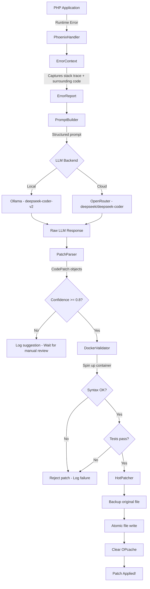
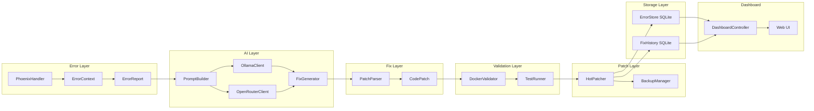
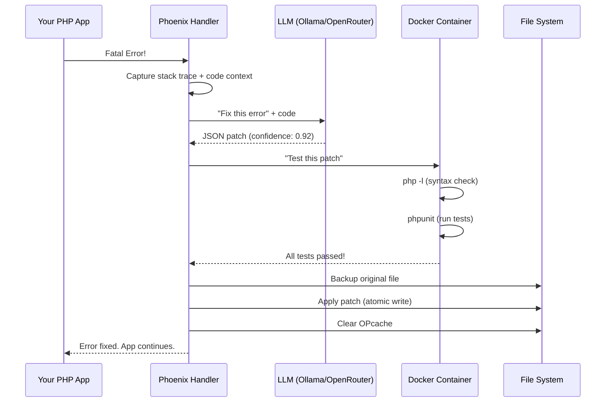
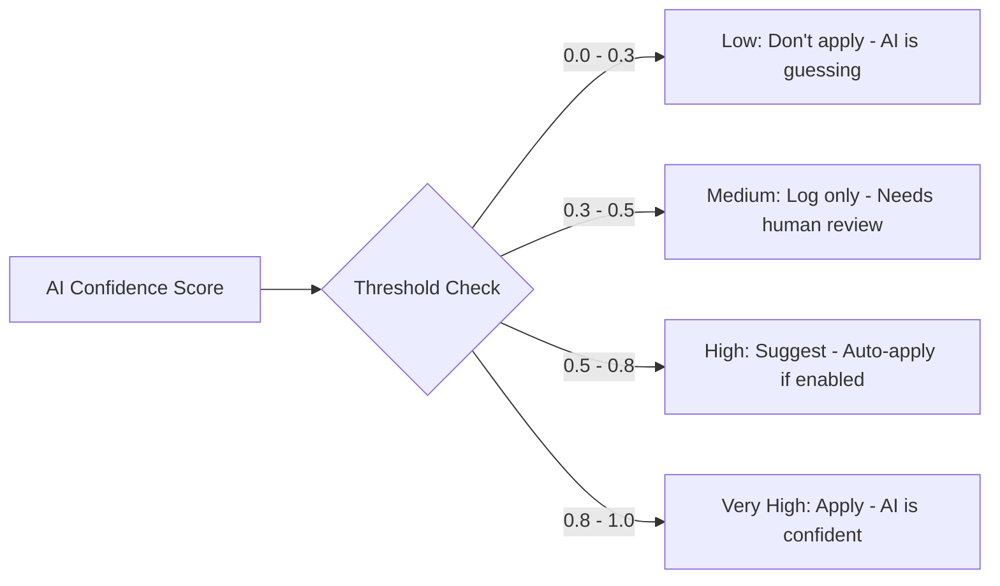
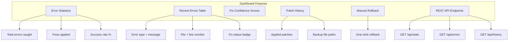
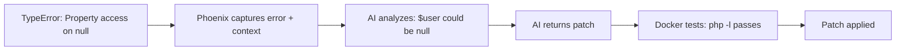
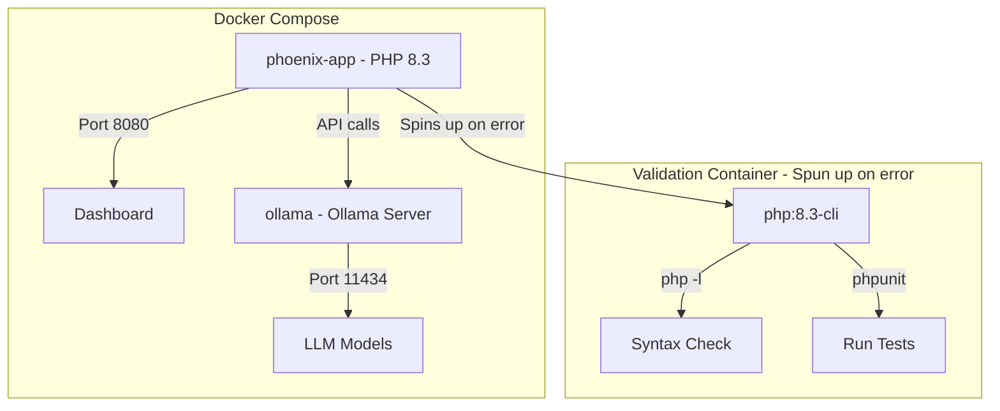
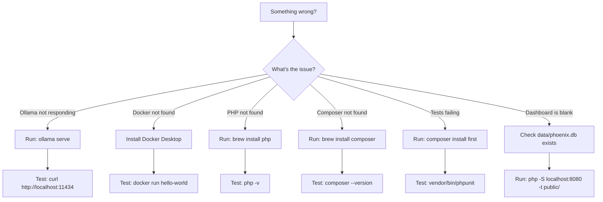
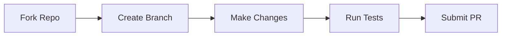

<div align="center">


<br>


---

# Phoenix

## Your Code Crashes. Phoenix Fixes It. Automatically.

Phoenix is a **self-healing PHP application architecture** that catches runtime errors, sends them to an AI model, gets a fix, tests it in a sandbox, and patches your live code — all without human intervention.

</div>

---

## Table of Contents

- [How It Works (60 Seconds)](#how-it-works--the-60-second-version)
- [Full Pipeline Diagram](#the-full-pipeline--visual-workflow)
- [Architecture Map](#architecture--component-map)
- [Quick Start (5 Minutes)](#quick-start--get-running-in-5-minutes)
- [Integrate Into Your App](#integrate-into-your-app--one-line)
- [Configuration](#configuration--tune-phoenix-your-way)
- [Dashboard](#dashboard--see-everything)
- [Project Structure](#project-structure--where-everything-lives)
- [Real-World Example](#real-world-example--phoenix-in-action)
- [LLM Backend Comparison](#llm-backend-comparison)
- [API Endpoints](#api-endpoints)
- [Testing](#testing)
- [Docker Setup](#docker-setup--full-stack)
- [Rollback](#rollback--undo-any-patch)
- [Troubleshooting](#troubleshooting)
- [Contributing](#contributing)
- [Roadmap](#roadmap)

---

## How It Works — The 60-Second Version

```
Your PHP App Crashes
        |
        v
+------------------+
| Phoenix catches  |  <-- set_error_handler, set_exception_handler
| the error        |      register_shutdown_function
+------------------+
        |
        v
+------------------+
| Captures:        |  <-- Stack trace + 10 lines of surrounding code
| - Error message  |      + file path + line number
| - Code context   |
+------------------+
        |
        v
+------------------+
| Sends to AI      |  <-- Ollama (local) or OpenRouter (cloud)
| "Fix this code"  |      Structured JSON-patch prompt
+------------------+
        |
        v
+------------------+
| AI returns a     |  <-- {"patches": [...], "confidence": 0.9}
| code patch       |
+------------------+
        |
        v
+------------------+
| Test in Docker   |  <-- Isolated container: php -l + phpunit
| container        |
+------------------+
        |
        v
+------------------+
| Patch applied    |  <-- Atomic write + OPcache clear
| to live code     |      + backup created
+------------------+
```

---

## The Full Pipeline — Visual Workflow



---

## Architecture — Component Map



---

## Quick Start — Get Running in 5 Minutes

### Prerequisites

| Requirement | Why You Need It | Install |
|-------------|-----------------|---------|
| **PHP 8.1+** | Runtime | `brew install php` |
| **Composer** | Dependencies | `brew install composer` |
| **Docker** | Sandbox testing | [Download Docker Desktop](https://docker.com/products/docker-desktop) |
| **Ollama** (optional) | Local AI inference | `brew install ollama` |

### Step-by-Step

```bash
# 1. Clone the repo
git clone https://github.com/soumyachk101/Pheonix.git
cd Pheonix

# 2. Install PHP dependencies
composer install

# 3. Copy environment config
cp .env.example .env

# 4. (Optional) Pull the AI model for local use
ollama pull deepseek-coder-v2

# 5. Start the dashboard
php -S localhost:8080 -t public/
```

Open **http://localhost:8080** in your browser to see the Phoenix dashboard.

---

## Integrate Into Your App — One Line

```php
<?php

// Add this at the top of your app's entry point (index.php, bootstrap, etc.)
require_once __DIR__ . '/vendor/autoload.php';
Phoenix\init();

// That's it. Your app is now self-healing.
// Any PHP error will trigger the full pipeline automatically.

// Your existing code below...
$app->run();
```

### What Happens When Your App Crashes



---

## Configuration — Tune Phoenix Your Way

Edit `.env` or `config/phoenix.php`:

```env
# Which AI brain to use?
PHOENIX_LLM_BACKEND=ollama          # "ollama" (local) or "openrouter" (cloud)

# Ollama settings (local, free, private)
PHOENIX_OLLAMA_BASE_URL=http://localhost:11434
PHOENIX_OLLAMA_MODEL=deepseek-coder-v2

# OpenRouter settings (cloud, paid, more models)
OPENROUTER_API_KEY=sk-or-v1-xxxxx
PHOENIX_OPENROUTER_MODEL=deepseek/deepseek-coder

# Should Phoenix auto-apply fixes?
PHOENIX_AUTO_APPLY=true             # true = auto-fix, false = suggest only
PHOENIX_MIN_CONFIDENCE=0.8          # Only auto-apply if AI confidence >= 80%
```

### Confidence Thresholds — What They Mean



| Score Range | Meaning | Phoenix Action |
|-------------|---------|----------------|
| **0.0 - 0.3** | AI is guessing | Ignore, log only |
| **0.3 - 0.5** | Low confidence | Log, flag for human review |
| **0.5 - 0.8** | Moderate confidence | Suggest fix in dashboard |
| **0.8 - 1.0** | High confidence | Auto-apply (if enabled) |

---

## Dashboard — See Everything

The built-in dashboard provides real-time visibility into errors and fixes.

### Features



### Dashboard Preview

```
+----------------------------------------------------------+
|  Phoenix Dashboard                                       |
+----------------------------------------------------------+
|                                                          |
|  [Total Errors: 12]  [Fixes Applied: 9]  [Rate: 75.0%]  |
|                                                          |
|  Recent Errors                                           |
|  +--------+-----------+------------------+----------+    |
|  | Time   | Type      | Message          | Status   |    |
|  +--------+-----------+------------------+----------+    |
|  | 14:23  | TypeError | Argument #1...   | Fixed    |    |
|  | 14:20  | Warning  | Undefined var...  | Suggested|    |
|  | 14:15  | Error    | Call to undef...  | Fixed    |    |
|  +--------+-----------+------------------+----------+    |
|                                                          |
|  Patch History                                           |
|  +--------+--------+------------------+-------+          |
|  | Time   | Action | File             | Line  |          |
|  +--------+--------+------------------+-------+          |
|  | 14:23  |Applied | /src/User.php    | 42    |          |
|  | 14:15  |Applied | /src/Auth.php    | 87    |          |
|  +--------+--------+------------------+-------+          |
+----------------------------------------------------------+
```

---

## Project Structure — Where Everything Lives

```
Pheonix/
|
|-- src/
|   |-- ErrorHandler/           <-- Catches errors
|   |   |-- PhoenixHandler.php      Main handler (hooks into PHP)
|   |   |-- ErrorContext.php        Captures code context
|   |   |-- ErrorReport.php         Error data object
|   |
|   |-- LLM/                    <-- Talks to AI
|   |   |-- LLMInterface.php        Contract for backends
|   |   |-- OllamaClient.php        Local AI (free)
|   |   |-- OpenRouterClient.php    Cloud AI (paid)
|   |   |-- PromptBuilder.php       Formats fix prompts
|   |
|   |-- Fixer/                  <-- Parses AI responses
|   |   |-- FixGenerator.php        Orchestrator
|   |   |-- CodePatch.php           Patch data object
|   |   |-- PatchParser.php         JSON -> patches
|   |
|   |-- Validator/              <-- Tests fixes safely
|   |   |-- DockerValidator.php     Runs in Docker
|   |   |-- TestRunner.php          PHPUnit executor
|   |
|   |-- Patcher/                <-- Applies fixes
|   |   |-- HotPatcher.php          Atomic file writer
|   |   |-- BackupManager.php       Backup/rollback
|   |
|   |-- Storage/                <-- Persists data
|   |   |-- ErrorStore.php          SQLite errors table
|   |   |-- FixHistory.php          Audit trail
|   |
|   |-- Dashboard/              <-- Web UI
|   |   |-- DashboardController.php Dashboard page
|   |
|   |-- bootstrap.php           <-- One-line init
|
|-- config/
|   |-- phoenix.php             <-- All settings
|
|-- docker/
|   |-- Dockerfile.php-runner   <-- Validation container
|   |-- docker-compose.yml      <-- Full stack
|
|-- tests/                      <-- PHPUnit tests
|-- public/
|   |-- index.php               <-- Dashboard entry
|
|-- composer.json
|-- .env.example
```

---

## Real-World Example — Phoenix in Action

### The Bug

```php
// src/UserService.php — Line 15
public function getUserName(?string $userId): string
{
    $user = $this->db->find($userId);
    return $user->name;  // BUG: $user could be null
}
```

### What Phoenix Does



### The AI-Generated Fix

```php
// src/UserService.php — Line 15 (after Phoenix patch)
public function getUserName(?string $userId): string
{
    $user = $this->db->find($userId);
    return $user?->name ?? 'Unknown';  // FIXED: null-safe access
}
```

### AI Response (stored in database)

```json
{
    "root_cause": "Accessing property 'name' on potentially null $user object",
    "patches": [
        {
            "file": "/app/src/UserService.php",
            "line": 15,
            "old": "return $user->name;",
            "new": "return $user?->name ?? 'Unknown';"
        }
    ],
    "confidence": 0.92
}
```

---

## LLM Backend Comparison

| Feature | Ollama (Local) | OpenRouter (Cloud) |
|---------|---------------|-------------------|
| **Cost** | Free | Pay per token |
| **Privacy** | Data stays local | Sent to cloud |
| **Speed** | Depends on hardware | Fast (API) |
| **Models** | deepseek-coder-v2 | 50+ models available |
| **Setup** | `ollama pull model` | API key only |
| **Offline** | Yes | No |
| **Best For** | Development, privacy-sensitive | Production, model variety |

### Switching Backends

```bash
# Use local Ollama (default, free, private)
PHOENIX_LLM_BACKEND=ollama

# Switch to OpenRouter cloud (paid, more models)
PHOENIX_LLM_BACKEND=openrouter
OPENROUTER_API_KEY=sk-or-v1-your-key-here
```

---

## API Endpoints

Phoenix exposes a REST API for programmatic access:

```bash
# Get error statistics
curl http://localhost:8080/api/stats
# Response: {"total_errors":12,"fixes_applied":9,"fix_rate":75.0}

# Get recent errors
curl http://localhost:8080/api/errors?limit=10

# Get patch history
curl http://localhost:8080/api/history?limit=20
```

---

## Testing

```bash
# Run all tests
composer test

# Or directly with PHPUnit
vendor/bin/phpunit

# Run a specific test file
vendor/bin/phpunit tests/PatchParserTest.php
```

### What's Tested

| Test File | What It Verifies |
|-----------|-----------------|
| `PatchParserTest.php` | JSON parsing, markdown extraction, confidence clamping |
| `ErrorContextTest.php` | Code context extraction, exception handling, prompt generation |
| `BackupManagerTest.php` | Backup creation, restore, listing |
| `PromptBuilderTest.php` | Prompt formatting, error info inclusion |

---

## Docker Setup — Full Stack

```bash
# Start everything (Phoenix app + Ollama server)
docker-compose -f docker/docker-compose.yml up -d

# View logs
docker-compose -f docker/docker-compose.yml logs -f

# Stop everything
docker-compose -f docker/docker-compose.yml down
```

### Container Architecture



---

## Rollback — Undo Any Patch

Phoenix creates backups before every patch. You can rollback anytime:

### Via Code

```php
use Phoenix\Patcher\BackupManager;

$backup = new BackupManager('backups/');

// List all backups for a file
$backups = $backup->listBackups('/app/src/UserService.php');

// Restore the latest backup
$latest = $backup->getLatestBackup('/app/src/UserService.php');
$backup->restore($latest, '/app/src/UserService.php');
```

### Via Dashboard

Click the "Rollback" button on any patch entry in the Patch History table.

---

## Troubleshooting



### Common Fixes

| Problem | Solution |
|---------|----------|
| `Ollama connection refused` | Start Ollama: `ollama serve` |
| `Docker not found` | Install [Docker Desktop](https://docker.com/products/docker-desktop) |
| `Class not found` | Run `composer install` |
| `No errors showing` | Trigger a test error in your app |
| `Dashboard blank` | Check PHP is running: `php -v` |

---

## Contributing

We welcome contributions! Here's how:



1. **Fork** the repository
2. **Create** your feature branch: `git checkout -b feature/amazing-feature`
3. **Commit** your changes: `git commit -m 'Add amazing feature'`
4. **Push** to the branch: `git push origin feature/amazing-feature`
5. **Open** a Pull Request

---

## Roadmap

- [ ] Async error processing (queue-based with Redis)
- [ ] Webhook notifications (Slack, Discord, Email)
- [ ] Multi-file patch support
- [ ] Learning from past fixes (vector memory with ChromaDB)
- [ ] Plugin system for custom validators
- [ ] PHPStan / Psalm static analysis integration
- [ ] Kubernetes sidecar mode
- [ ] VS Code extension for live fix previews

---

## License

MIT License — see [LICENSE](LICENSE) for details.

---

<div align="center">

**Built with love by the Phoenix team**

<br>


<br><br>

**Phoenix: Because your code deserves a second life.**

</div>
